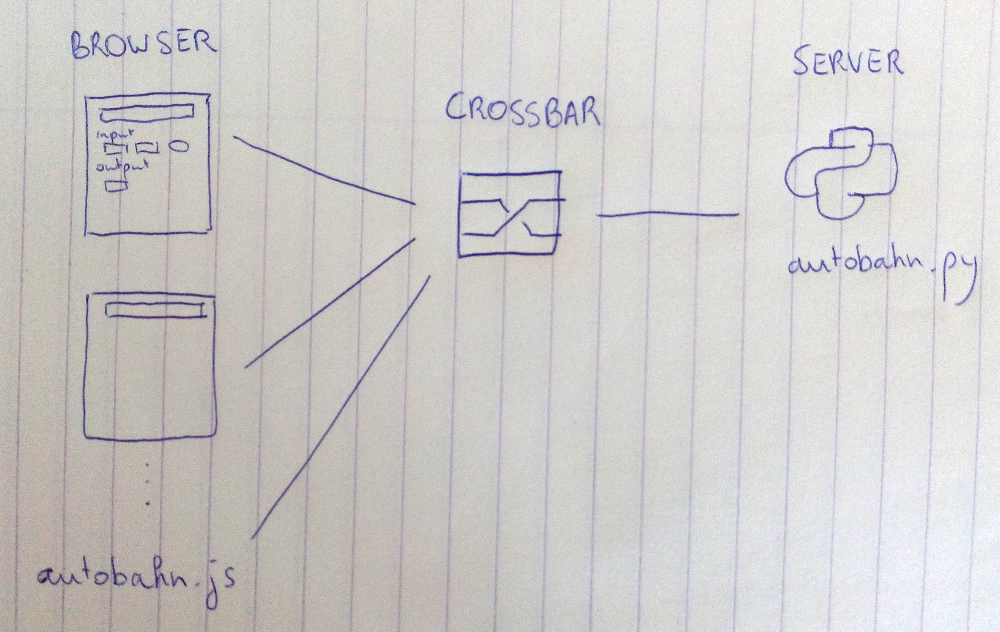
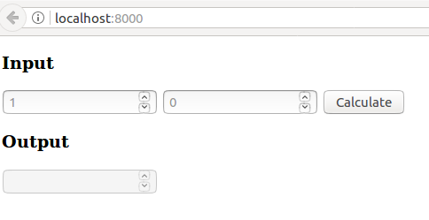
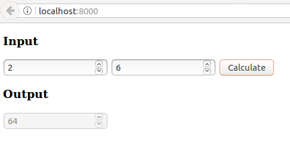

# crossbar.io tutorial
This is part 1 of a series of crossbar.io tutorials.

## What is crossbar
   > Crossbar.io is an open source networking platform for distributed and microservice applications. It implements the open Web Application Messaging Protocol (WAMP), is feature rich, scalable, robust and secure. Let Crossbar.io take care of the hard parts of messaging so you can focus on your app's features. [http://crossbar.io/]

All programming languages have their strengths and weaknesses. Wouldn't it be nice to write an application using the different strengths of each application, for example the concurrency of go, the mathematical power of python/numpy, and somehow let those components communicate and form one distributed application.

Crossbar.io is a tool to do just that. It contains a server to route messages and do the communication, and client libraries in multiple languages.  

In technical jargon the clients talk to each other in a protocol called [WAMP](http://wamp-proto.org/), the router is called [crossbar](http://crossbar.io), and the client libraries are called [Autobahn](http://crossbar.io/autobahn/).

Officially supported client libraries (a.k.a autobahn) are:
  * Javascript
  * Python
  * Cpp

Community supported client libraries are:
  * Java
  * Haskell
  * PHP
  * Ruby
  * [many others](http://crossbar.io/about/Supported-Languages/)

# Post office analogy
In a way, crossbar.io acts like a post office. Imagine you are a traveling salesman, and you want everyone in the town to know you have arrived with vacuum cleaners. The salesman would walk up to the post office, and ask to deliver a message that he has arrived with vacuum cleaners. The post office then makes copies of his message and passes it on to all interested towns folk. This is called **publish/subscribe** (*pub/sub*), one application publishes a message to post office with a specific **topic**. The post office than delivers that message to all other applications subscribed to that **topic**.

In another scenario you are trying to do you taxes, but all the different tax codes and exemptions and counter exemptions and counter-counter exemptions are making your head hurt. So you walk into the post office and you say: "Here are all my revenues and payments from last year, please deliver it to someone who can do this stuff, and deliver the finished tax documents back to me". This is called **remote procedure call** (*RPC*). One application, the *caller*, delivers input data to the post office, asking for a specific calculation. This data is send to one other application, the *callee* who has registered himself with the post office as being able to do that calculated. The results are then send back to the initial application.

The post office (crossbar.io) is called the **message broker** or **router**. It's responsible to maintain a list of all publishers and subscribers of the *pub/sub* relationships. It must also maintain a list of all possible methods and functions that can be called as a remote procedure call. It pushes messages around and makes sure the results get back to the right applications.

There are many other message brokers like crossbar.io out there, but what makes crossbar special is that it's a **polyglot** (many different client libraries in multiple languages), it connects **different transport levels** (connect HTTP/REST to MQTT to websockets), has multiple methods for **authentication** (make sure an application is who he says he is) and **authorization** (define what applications can access what parts of the system), and is **easy to use**.

# Components
In this tutorial you will set up a *router*, and write a minimal application with a *javascript* front-end remotely calling python procedures (*RPC*) over websockets.

# Step 1: Router
Start by making a folder for the router

    mkdir router
    cd router

The router can be easily installed from PyPI using pip  

    pip install crossbar

Inside the router folder, create a new configuration file.
    crossbar init

This will create the a configuration folder (.crossbar) and a web server (web)  

    .  
    ├── .crossbar  
    │   ├── config.json  
    │   ├── key.priv  
    │   └── key.pub  
    ├── README.md  
    └── web  
      ├── backend.html  
      ├── frontend.html  
      ├── index.html  
      └── js  
          ├── autobahn.js  
          ├── autobahn.min.jgz  
          ├── autobahn.min.js  
          ├── CHECKSUM.MD5  
          ├── CHECKSUM.SHA1  
          ├── CHECKSUM.SHA256  
          └── LICENSE  

This tutorial will be focusing on a minimal router, so the web component will not be necessary.

    rm -r ./web

Within the the config file ./.crossbar/config.json, find and delete the entire web component.

      "web": {
          "paths": {
              "/": {
                  "type": "static",
                  "directory": "../web"
              }
          }
      }

The router is sub dived into different **realms**, only applications withing the same realm can send messages to each other. The default realm is called *realm1*. Go ahead and change the realm to a name of you choice. I will be calling it *crossbar-example*.

    "realms": [
        {
            "name": "crossbar-example",
            ...
        }
    ]

Within the realm there can be different roles. Authentication and authorization can be configured here, but this tutorial will go with the default configuration, i.e. anyone can access anything.

    "roles": [
        {
            "name": "anonymous",
            "permissions": [
                {
                    "uri": "",
                    "match": "prefix",
                    "allow": {
                        "call": true,
                        "register": true,
                        "publish": true,
                        "subscribe": true
                    },
                    "disclose": {
                        "caller": false,
                        "publisher": false
                    },
                    "cache": true
                }
            ]
        }
    ]

Now that the router is configured, it can be started with

    crossbar start

By default, crossbar will now be starting a websocket server available on ws://localhost:8080/ws. Keep this terminal window open, and start a new terminal window for the python client.

# Step 2: Clients
We will now build two clients: a python back-end, communicating with a javascript front-end.  
Start by making a folder for you clients  

    mkdir clients  
    cd clients  

## Python back-end
Within the clients folder, create a folder for you python back-end

    mkdir python  
    cd python  

The client library for python is called autobahn, there are two flavors of autobahn for python, but we will go with the twisted variant

    pip install autobahn[twisted]

And create a file for your python client

    touch client.py

The aim of this paragraph is to create a python function that can be called from all other components connected to our router. The function we will be making, *exp(x, y)*, takes the exponential of two input. Add this to client.py

    def exp(x, y):
      return float(x)\*\*float(y)

This function must be wrapped in a *ApplicationSession* provided by autobahn, and must be given a name (for example, com.crossbar_example.exp):

    from autobahn.twisted.wamp import ApplicationSession
    from twisted.internet.defer import inlineCallbacks

    def exp(x, y):
        return float(x)\*\*float(y)

    class MathApplication(ApplicationSession):
        """A component that does simple math."""
        @inlineCallbacks
        def onJoin(self, details):
            yield self.register(exp, 'com.crossbar_example.exp')

Lastly, an ApplicationRunner must be created that will run this MathApplication, connect it to our router in the correct realm.

    if __name__ == "__main__":
        from autobahn.twisted.wamp import ApplicationRunner

        runner = ApplicationRunner(
            url=u"ws://localhost:8080/ws",
            realm=u"crossbar-example"
        )
        runner.run(MathApplication)

The completed client.py looks like this:

    from autobahn.twisted.wamp import ApplicationSession
    from twisted.internet.defer import inlineCallbacks

    def exp(x, y):
        return float(x)\*\*float(y)

    class MathApplication(ApplicationSession):
        """An application that does simple math."""
        @inlineCallbacks
        def onJoin(self, details):
            yield self.register(exp, 'com.crossbar_playground.exp')

    if __name__ == "__main__":
        from autobahn.twisted.wamp import ApplicationRunner

        runner = ApplicationRunner(
            url=u"ws://localhost:8080/ws",
            realm=u"crossbar-example"
        )
        runner.run(MathApplication)

Execute client.py

    python client.py

Keep this terminal window running, and start a new window for the javascript client.

## Javascript front-end  
With the simple python math application running, it is time to make our javascript front-end that will call the python's exp function. As this tutorial aims to create a minimal application, we will write the entire front-end in a single index.html file

    cd ..
    mkdir js
    cd js

Get the minified autobahn javascript library

    wget https://raw.githubusercontent.com/crossbario/autobahn-js-built/master/autobahn.min.js

And create index.html

    touch index.html

Start by creating a HTML document that links the autobahn.min.js library and contains
  * Two input fields
  * A submit button
  * An output field

The HTML looks like this  

    <!DOCTYPE html PUBLIC "-//W3C//DTD HTML 4.01//EN"
        "http://www.w3.org/TR/html4/strict.dtd">
    <html lang="en">
      <head>
        <meta http-equiv="content-type" content="text/html; charset=utf-8">
        <title>Crossbar minimal web client</title>
        <link rel="stylesheet" type="text/css" href="style.css">
        
      </head>
      <body>
        

          

            <h3>Input</h3>
            <input type="number" id="number_x" placeholder="1"></input>
            <input type="number" id="number_y" placeholder="0"></input>
            <input type="button" id="button" value="Calculate"></input>
          

          

            <h3>Output</h3>
            <input type="number" id="number_z" disabled></input>
          

        

        
      </body>
    </html>

This document can now be served with any webserver of your choice, for example

    python -m SimpleHTTPServer 8000

Direct a browser to localhost:8000 and you will see this

In the javascript application first find the DOM elements for our input fields, button and output fields.

      var domElements = {
        input_number_x: document.getElementById("number_x"),
        input_number_y: document.getElementById("number_y"),
        input_button: document.getElementById("button"),
        output_number_z: document.getElementById("number_z")
      };

Then write a function that will be called once the connection with the crossbar router has been made. The first argument to this function is a session object. With the session object we can call the exponent function we wrote in client.py.

    var on_crossbar_connect = function(session){
      session.call(
          'function_name',
          [argument_0, argument_1, ...]
      ).then(
          function(result){
            // Do things with result
          }
      )  
    }

For our exponential function

    var on_crossbar_connect = function(session){
      console.log("Connected to crossbar router");
      domElements.input_button.addEventListener(
        "click",
        function(){
          var number_x = domElements.input_number_x.value;
          var number_y = domElements.input_number_y.value;

          session.call(
            'com.crossbar_example.exp',
            [number_x, number_y]
          ).then(
             function (res) {
                domElements.output_number_z.value = res;
             }
          );
        }
      );
    };

Lastly, connect the on_crossbar_connect function to the crossbar router  

    var connect_to_crossbar = (function(){
      console.log("Connecting to crossbar router");
      var connection = new autobahn.Connection(
        {
          url: 'ws://localhost:8080/ws',
          realm: 'crossbar-example'
        }
      );
      connection.onopen = on_crossbar_connect;
      connection.open();
    })();

All together, the index.html looks like this:

    <!DOCTYPE html PUBLIC "-//W3C//DTD HTML 4.01//EN"
        "http://www.w3.org/TR/html4/strict.dtd">
    <html lang="en">
      <head>
        <meta http-equiv="content-type" content="text/html; charset=utf-8">
        <title>Crossbar minimal web client</title>
        <link rel="stylesheet" type="text/css" href="style.css">
        
      </head>
      <body>
        

          

            <h3>Input</h3>
            <input type="number" id="number_x" placeholder="1"></input>
            <input type="number" id="number_y" placeholder="0"></input>
            <input type="button" id="button" value="Calculate"></input>
          

          

            <h3>Output</h3>
            <input type="number" id="number_z" disabled></input>
          

        

        
      </body>
    </html>

Restart the server  

    python -m SimpleHTTPServer 8000

Refresh your browser (localhost:8000) and test the calculator.

## What now?
You've learned how to call python functions from javascript function. This is only a small subset of the possibilities crossbar.io enables. Here are some more ideas:
  * Distribute a python application over multiple cores or machines
  * Write an application in a multiple of languages, connecting them all together through a crossbar router
  * Maintain a centralized state with pub/sub routines
  * Fine grained authentication and authorization of methods

In part 2 of this tutorial series we will build a chat application, using pub/sub routines and a little bit of authentication+authorization: [A chat application (PUB/SUB and shared secret authentication/authorization)](https://github.com/drieswijns/crossbario_tutorial/tree/master/2_chatroom)
