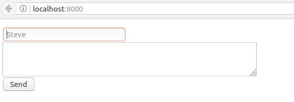
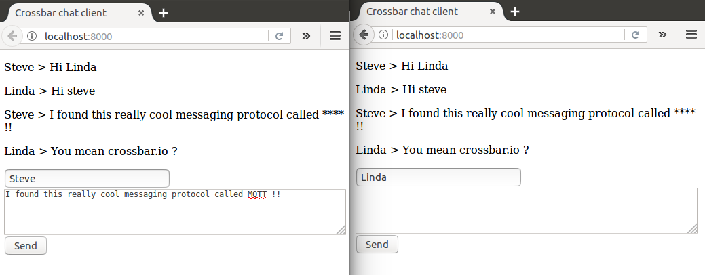

# crossbar.io chat application

In this tutorial we will be building a chat application using crossbars pub-sub routines.

The application will have a server - clients structure: all messages send by the clients will pass through the server, and the server will do additional profanity checks.

# Step 1: Router

We will create a router just like we did in [tutorial 1](https://github.com/drieswijns/crossbario_tutorial/tree/master/1_minimal).

    mkdir router
    cd router

The router can be easily installed from PyPI using pip  
    pip install crossbar

Inside the router folder, create a new configuration file.
    crossbar init

This will create the a configuration folder (.crossbar) and a web server (web)  

    .  
    ├── .crossbar  
    │   ├── config.json  
    │   ├── key.priv  
    │   └── key.pub  
    ├── README.md  
    └── web  
      ├── backend.html  
      ├── frontend.html  
      ├── index.html  
      └── js  
          ├── autobahn.js  
          ├── autobahn.min.jgz  
          ├── autobahn.min.js  
          ├── CHECKSUM.MD5  
          ├── CHECKSUM.SHA1  
          ├── CHECKSUM.SHA256  
          └── LICENSE  

This tutorial will be focusing on a minimal router, so the web component will not be necessary.

    rm -r ./web

Within the the config file ./.crossbar/config.json, find and delete the entire web component.

      "web": {
          "paths": {
              "/": {
                  "type": "static",
                  "directory": "../web"
              }
          }
      }

Create a realm for our chat application:

    "realms": [
        {
            "name": "crossbar-chat",
            "roles": [
                ...
            ]
        }
    ]

## Roles (Authorization)
Unlike previous tutorial, we now have two different *types* of clients connected: one role serving as the server, and one role for the multiple clients. This is reflected in the config file as two different *roles*, the *server* role and the *public* role.

    "realms": [
        {
            "name": "crossbar-chat",
            "roles": [
                {
                  "name": "server",
                  "permissions": [
                      ...
                  ]
                },
                {
                    "name": "public",
                    "permissions": [
                        ...
                    ]
                }
            ]
        }
    ]

We will give the server full access, but restrict to public role (chat clients) to calling methods, and subscribing to messages.

    "roles": [
        {
          "name": "server",
          "permissions": [
              {
                  "uri": "",
                  "match": "prefix",
                  "allow": {
                    "call": true,
                    "register": true,
                    "publish": true,
                    "subscribe": true
                  },
                  "disclose": {
                    "caller": true,
                    "publisher": true
                  },
                  "cache": true
              }
          ]
        },
        {
            "name": "public",
            "permissions": [
                {
                    "uri": "",
                    "match": "prefix",
                    "allow": {
                        "call": true,
                        "register": false,
                        "publish": false,
                        "subscribe": true
                    },
                    "disclose": {
                        "caller": true,
                        "publisher": true
                    },
                    "cache": true
                }
            ]
        }
    ]

## Authentication
We do no want any random person to be able to register as a server, therefore we need to set up some authentication. We will setup **ticket** based authentication, i.e. authentication by means of a **shared secret**.

In the *config.json* file, restrict access to the server role using ticket based authentication. Access to the public role will remain unauthenticated:

    "transports": [
        {
            "type": "universal",
            "endpoint": {
                "type": "tcp",
                "port": 8080
            },
            "websocket": {
                "ws": {
                    "type": "websocket",
                    "auth": {
                        "ticket": {
                            "type": "static",
                            "principals": {
                                "admin": {
                                    "ticket": "supersecret",
                                    "role": "server"
                                }
                            }
                        },
                        "anonymous": {
                            "type": "static",
                            "role": "public"
                         }
                    }
                }
            }
        }
    ]

The full configuration file looks like this

    {
        "version": 2,
        "controller": {},
        "workers": [
            {
                "type": "router",
                "realms": [
                    {
                        "name": "crossbar-chat",
                        "roles": [
                            {
                              "name": "server",
                              "permissions": [
                                  {
                                      "uri": "",
                                      "match": "prefix",
                                      "allow": {
                                        "call": true,
                                        "register": true,
                                        "publish": true,
                                        "subscribe": true
                                      },
                                      "disclose": {
                                        "caller": true,
                                        "publisher": true
                                      },
                                      "cache": true
                                  }
                              ]
                            },
                            {
                                "name": "public",
                                "permissions": [
                                    {
                                        "uri": "",
                                        "match": "prefix",
                                        "allow": {
                                            "call": true,
                                            "register": false,
                                            "publish": false,
                                            "subscribe": true
                                        },
                                        "disclose": {
                                            "caller": true,
                                            "publisher": true
                                        },
                                        "cache": true
                                    }
                                ]
                            }
                        ]
                    }
                ],
                "transports": [
                    {
                        "type": "universal",
                        "endpoint": {
                            "type": "tcp",
                            "port": 8080
                        },
                        "websocket": {
                            "ws": {
                                "type": "websocket",
                                "auth": {
                                    "ticket": {
                                        "type": "static",
                                        "principals": {
                                            "admin": {
                                                "ticket": "supersecret",
                                                "role": "server"
                                            }
                                        }
                                    },
                                    "anonymous": {
                                        "type": "static",
                                        "role": "public"
                                     }
                                }
                            }
                        }
                    }
                ]
            }
        ]
    }

Now that the router is configured, it can be started with

    crossbar start

By default, crossbar will now be starting a websocket server available on ws://localhost:8080/ws. Keep this terminal window open, and start a new terminal window for the nodejs chat server.

# Step 2: Clients
We will now build two clients: nodejs chat server application, and a javascript browser based chat client.  
Start by making a folder for the clients

    mkdir clients  
    cd clients  

## Chat server application
Our chat server application will perform two tasks:
  1. Clients can send messages to the server
  2. The server checks the message for profanity, and publishes the message to the other clients

To do this we will:
  1. Register a function *com.crossbar-chat.new-message*, clients will call this method when they want to send a message
  2. Within this newMessage function, publish the message to a topic *com.crossbar-chat.messages*

Make a folder for the server application, and install autobahn

    mkdir js-server
    cd js-server
    npm install --save autobahn

Just like in the first tutorial, we use autobahn to connect to the router. Create a file server.js

    "use strict"

    const autobahn = require('autobahn');

    const connection = new autobahn.Connection(
      {
        url: 'ws://localhost:8080/ws',
        realm: 'crossbar-chat',
      }
    );

    connection.onclose = (reason, details) => {
      console.warn(`Connection closed: ${reason}`);
    }

    connection.onopen = (session) => {
      console.log("Connection opened");
      console.log(JSON.stringify(session, null, 2));

      // new-message function
      session.register(
        'com.crossbar-chat.new-message',
        (args, kwargs) => {
          const nickname = kwargs.nickname;
          const message = kwargs.message;

          // profanity check
          const clean_message = message.replace("MQTT", "****");

          // publish clean message to topic com.crossbar-chat.messages
          session.publish(
            'com.crossbar-chat.messages',
            [],
            {
              nickname: nickname,
              message: clean_message
            }
          );
        }
      );
    };

    connection.open();

Now run the server with

    node server.js

What's that, an error message?

    Potentially unhandled rejection [1] {"error":"wamp.error.not_authorized","args":["session is not authorized to register procedure 'com.crossbar-chat.new-message'"],"kwargs":{}} (WARNING: non-Error used)

If you remember, we didn't want anyone to be able to act as a server for our application (they might disable our profanity check), so we set up ticket based authentication. So our server will need to authenticate himself to the router. Replace the connection object with the following:

    const config = {
      authid: "admin",
      ticket: "supersecret"
    }

    const connection = new autobahn.Connection(
      {
        url: 'ws://localhost:8080/ws',
        realm: 'crossbar-chat',
        authid: config.authid,
        onchallenge: (session, method, extra) => {
          console.log("Authenticating");
          if(method !== "ticket"){
            console.warn("Authentication method not recognized.");
            return;
          }
          return config.ticket;
        }
      }
    );

Restart the server

    node server.js

If you see

    Authenticating
    Connection opened

The chat server application is running. Open a new terminal window for the chat client application

## Chat client
Our chat client will be a simple HTML/JS application that lives in the browser. Create a new folder for the chat client

    cd ..
    mkdir js
    cd js

Get the autobahn javascript library

    wget https://raw.githubusercontent.com/crossbario/autobahn-js-built/master/autobahn.min.js

And create index.html

    touch index.html

Start with this minimal HTML boilerplate, which has an output field, and two

    <!DOCTYPE html PUBLIC "-//W3C//DTD HTML 4.01//EN"
        "http://www.w3.org/TR/html4/strict.dtd">
    <html lang="en">
      <head>
        <meta http-equiv="content-type" content="text/html; charset=utf-8">
        <title>Crossbar chat client</title>
        <link rel="stylesheet" type="text/css" href="style.css">
        
      </head>
      <body>
        

          

          

            <input type="text" id="nickname" placeholder="Steve"></input> 
            <textarea
              id="message"
              cols="70"
              rows="4">
            </textarea> 
            <input type="button" id="send" value="Send"></input>
          

        

        
      </body>
    </html>

The chat client can now be served with any webserver of your choice, for example

    python -m SimpleHTTPServer 8000

And you will see a beautiful application like this:

We now need to tell our application to connect to the crossbar router

    (function (){
      var domElements = {
        input_nickname: document.getElementById("nickname"),
        input_message: document.getElementById("message"),
        input_button: document.getElementById("send"),
        output: document.getElementById("chatlog")
      };

      var on_crossbar_connect = function(session){
        console.log("Connected to crossbar router");
      };

      (function(){
        console.log("Connecting to crossbar router");
        // Connect to crossbar unauthenticated ('anonymous role')
        var connection = new autobahn.Connection(
          {
            url: 'ws://localhost:8080/ws',
            realm: 'crossbar-chat'
          }
        );
        connection.onopen = on_crossbar_connect;
        connection.open();
      })();
    })();

Tell the application to subscribe to new messages, and write the messages to the screen.

    var on_crossbar_connect = function(session){
      console.log("Connected to crossbar router");

      session.subscribe(
        'com.crossbar-chat.messages',  // the topic we defined in server.js
        function(args, kwargs){
          // Incoming message
          // kwargs = {nickname: "...", message: "..."}
          var message = document.createElement("p");
          message.appendChild(
            document.createTextNode(kwargs.nickname+" > "+kwargs.message)
          );
          domElements.output.appendChild(message);
        }
      );
    };

Tell the application to call new-message whenever the send button is pressed.

    var on_crossbar_connect = function(session){
      // ...
      domElements.input_button.addEventListener(
        "click",
        function(){
          var message = {
            nickname: domElements.input_nickname.value,
            message: domelements.input_message.value
          };

          session.call(
            'com.crossbar-chat.new-message',
            [],
            message
          ).then(
            function(){
              domElements.input_message.value = "";
            }
          );
        }
      );
    };

Now open up two browser windows, and navigate to http://localhost:8000 . Enjoy your chat session!

